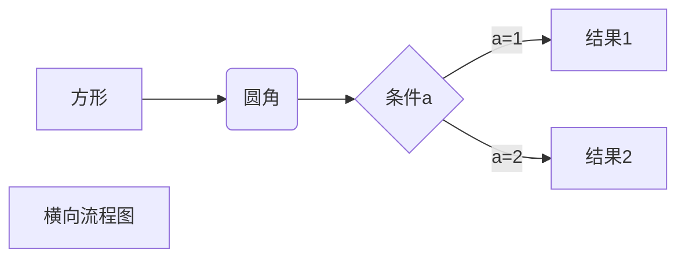
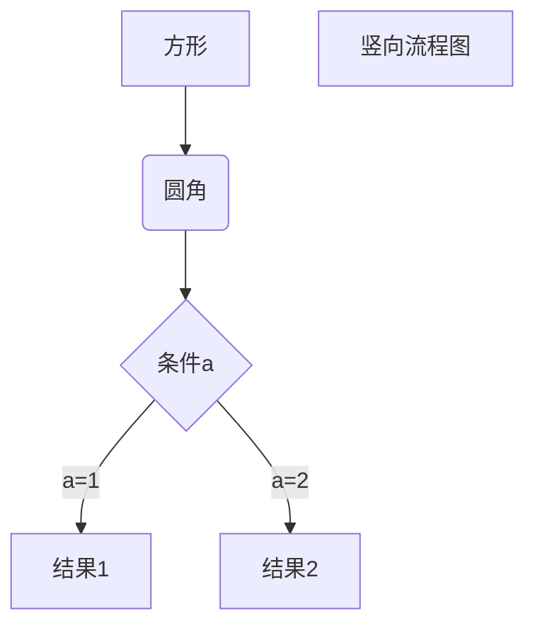
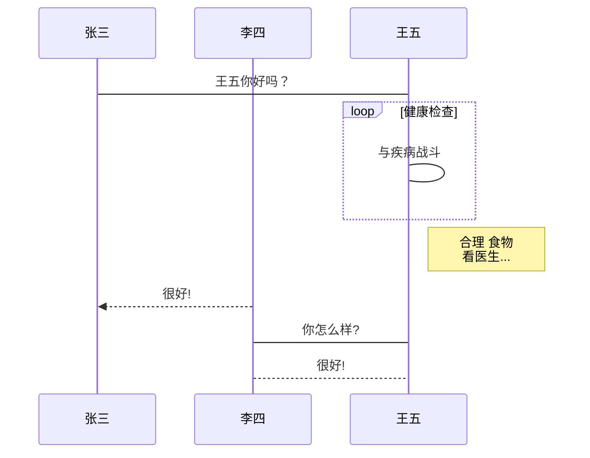
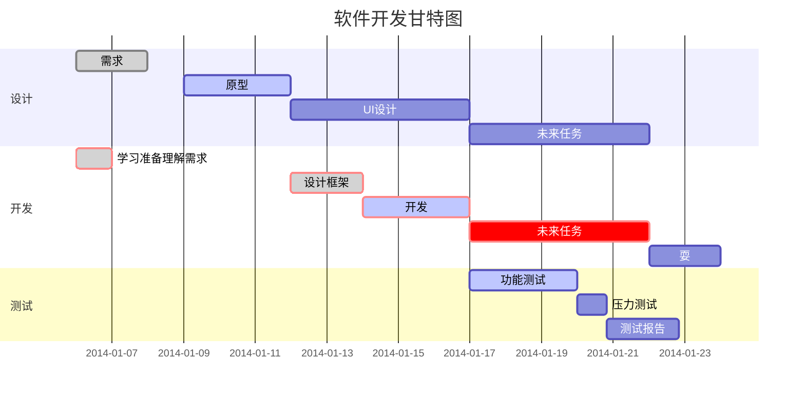

# notebook
### 这是一个私人笔记本
# markdown格式说明
## 标题
# 一级标题
## 二级标题
### 三级标题
#### 四级标题
##### 五级标题
###### 六级标题
## 段落
测试段落  
测试段落

测试段落
## 字体
*斜体文本*
_斜体文本_
**粗体文本**
__粗体文本__
***粗斜体文本***
___粗斜体文本___
## 分割线
---
***
___
## 删除线
~~已过期~~
## 下划线
<u>下划线</u>

## 脚注
创建脚注格式类似这样 [^脚注]。  
[^脚注]: 这就是脚注!!!
## Markdown 列表
### 无序列表
* 第一项
* 第二项
* 第三项
+ 第一项
+ 第二项
+ 第三项
- 第一项
- 第二项
- 第三项
### 有序列表
1. 第一项
2. 第二项
3. 第三项
### 列表嵌套
1. 第一项：
    - 第一项嵌套的第一个元素
    - 第一项嵌套的第二个元素
2. 第二项：
    - 第二项嵌套的第一个元素
    - 第二项嵌套的第二个元素
## Markdown 区块
> 区块  
> 这就是一个区块
### 区块嵌套
> 并且 你会发现
> > 区块也是可以嵌套的
> > > 我还可以继续嵌套
> > >
> > > > 我也可以一直嵌套
### 区块和列表
> 区块里面也能使用列表
>
> 1. 第一项
> 2. 第二项
> + 第一项
> + 第二项
> + 第三项
* 第一项
    > 当然
    > 列表里面也能使用区块
    >
    > > 理所应当的也可以嵌套
    > >
    > > > 继续嵌套
    > > >
    > > > > 一直嵌套  
* 第二项
## Markdown 代码
`printf()` 简单的标记一个函数
```java
//简单的再来段代码
public class HelloWorld {
	public static void main(String[] args) {
    	System.out.println("Hello World");
	}
}
```
## Markdown 链接
这是一个链接 [notebook](https://gitee.com/sj_zhang/notebook)
我们还能这么链接
<https://gitee.com/sj_zhang/notebook>
### 高级链接
这个链接用 1 作为网址变量 [Google][google]
这个链接用 notebook 作为网址变量 [Notebook][notebook]
然后在文档的结尾为变量赋值（网址）
[google]: http://www.google.com/
[notebook]: https://gitee.com/sj_zhang/notebook/
## Markdown 图片
  
  


## Markdown 表格
| 表头   | 表头   |
| ------ | ------ |
| 单元格 | 单元格 |
| 单元格 | 单元格 |

| 左对齐 | 右对齐 | 居中对齐 |
| :----- | -----: | :------: |
| 单元格 | 单元格 |  单元格  |
| 单元格 | 单元格 |  单元格  |
## Markdown 高级技巧
使用 <kbd>Ctrl</kbd>+<kbd>Alt</kbd>+<kbd>Del</kbd> 重启电脑
**文本加粗** 
\*\* 正常显示星号 \*\*
### Markdown 支持以下这些符号前面加上反斜杠来帮助插入普通的符号：
\\
\`
\*
\_
\{\}
\[]
\()
\#
\+
\_
\.
\!
### 公式
$$
\mathbf{V}_1 \times \mathbf{V}_2 =  \begin{vmatrix} 
\mathbf{i} & \mathbf{j} & \mathbf{k} \\
\frac{\partial X}{\partial u} &  \frac{\partial Y}{\partial u} & 0 \\
\frac{\partial X}{\partial v} &  \frac{\partial Y}{\partial v} & 0 \\
\end{vmatrix}
${$tep1}{\style{visibility:hidden}{(x+1)(x+1)}}
$$
## typora 画流程图、时序图(顺序图)、甘特图
1、横向流程图源码格式：

2、竖向流程图源码格式：

3、标准流程图源码格式：
```flow
st=>start: 开始框
op=>operation: 处理框
cond=>condition: 判断框(是或否?)
sub1=>subroutine: 子流程
io=>inputoutput: 输入输出框
e=>end: 结束框
st->op->cond
cond(yes)->io->e
cond(no)->sub1(right)->op
```
4、标准流程图源码格式（横向）：
```flow
st=>start: 开始框
op=>operation: 处理框
cond=>condition: 判断框(是或否?)
sub1=>subroutine: 子流程
io=>inputoutput: 输入输出框
e=>end: 结束框
st(right)->op(right)->cond
cond(yes)->io(bottom)->e
cond(no)->sub1(right)->op
```
5、UML时序图源码样例：
```sequence
对象A->对象B: 对象B你好吗?（请求）
Note right of 对象B: 对象B的描述
Note left of 对象A: 对象A的描述(提示)
对象B-->对象A: 我很好(响应)
对象A->对象B: 你真的好吗？
```
6、UML时序图源码复杂样例：
```sequence
Title: 标题：复杂使用
对象A->对象B: 对象B你好吗?（请求）
Note right of 对象B: 对象B的描述
Note left of 对象A: 对象A的描述(提示)
对象B-->对象A: 我很好(响应)
对象B->小三: 你好吗
小三-->>对象A: 对象B找我了
对象A->对象B: 你真的好吗？
Note over 小三,对象B: 我们是朋友
participant C
Note right of C: 没人陪我玩
```
7、UML标准时序图样例：

8、甘特图样例：
